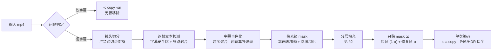
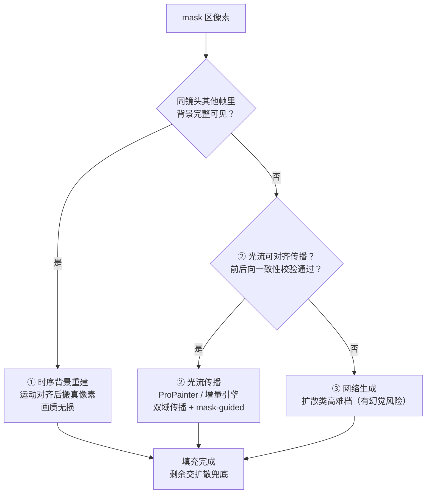
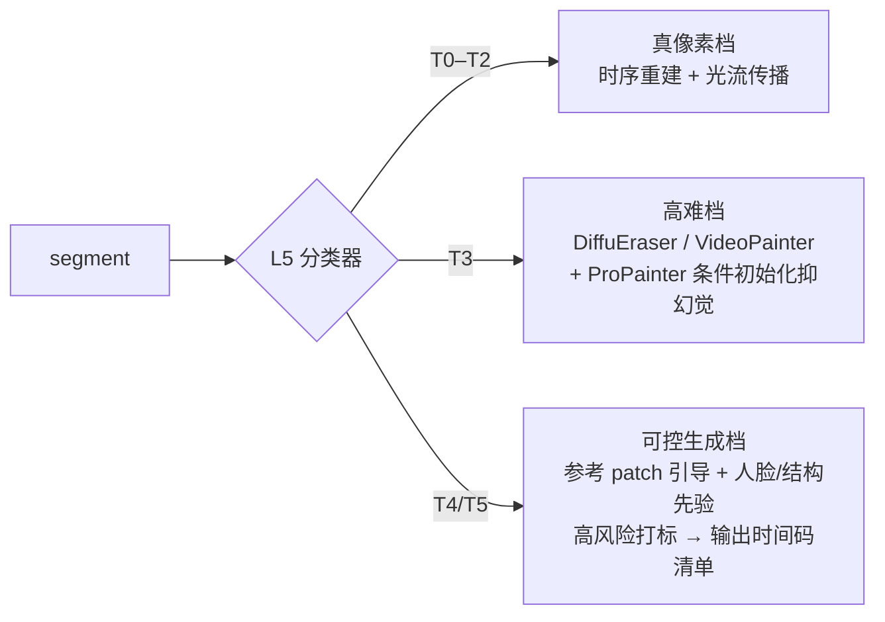
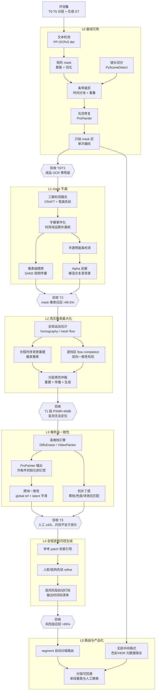

# 去字幕技术设计

> 本文重绘自设计会话 `baddff3a` 的完整技术思路（本地显卡去硬字幕，效果优先）。
> 核心结论：**天花板不在修复模型，而在 mask 质量 + 是否优先"搬运真实像素"而不是"生成像素"。**
> 技术路线按能力分五级（L0–L5）、按难度分六类（T0–T5），每级设验收门槛，不达标不进下一级。

## 1. 端到端管线

读法：

- **问题判定**先行：软字幕直接 `-sn` 无损完事；硬字幕再区分形态（纯描边 < 半透明底条 < 模糊/动效/艺术字）与背景运动类型（静止 / 运动 / 全程遮挡），它们决定 mask 策略与修复档位。
- **mask 生成决定 80% 效果**：逐帧检测只在字幕安全区（底部 25~35%、顶部 15%）跑；矩形框不够，必须聚成"字幕事件"并精修到笔画级；膨胀 4~9px 覆盖抗锯齿边，合成时 2~3px 软边过渡。
- **修复帧绝不整帧使用**：只替换 mask 区域，羽化 α 合成，避免全片二次退化。

## 2. 分层填充仲裁（能搬就别生成）

对每个被 mask 的像素，按优先级依次尝试，只有前两级都填不上的空洞才交给生成模型：

- 静止/平移镜头下，字幕区背景往往在别的帧里完整可见 —— 直接搬真像素，这是投入产出比最高的一段。
- 光流质量兜底：遮挡区光流本身不可靠，必须用 mask 做 flow completion，并对遮挡区做前后向一致性校验。
- 修复引擎档位：基线 ProPainter（双域传播 + 稀疏 mask-guided transformer）；预览档 E2FGVI-HQ / FGT；高难档 DiffuEraser / VideoPainter（显存与耗时高一个量级，偶发幻觉需抽检）。

## 3. 难度分层与路由（T0–T5）

评测集是整条路线图的地基，先按此分层构造样本（每类 20~30 段、每段 5~15 秒），再用干净片源 + 程序烧字幕做一套"有 GT"的合成集：

| 级别 | 字幕形态 | 背景 | 可达上限 |
|---|---|---|---|
| T0 | 硬字幕、纯白描边、固定位置 | 静止镜头 | 无损级 |
| T1 | 同上 | 平移/缓慢运动 | 几乎无损 |
| T2 | 半透明底条 / 双语多行 | 一般运动 | 很好 |
| T3 | 艺术字、渐变、发光、动效弹幕 | 一般运动 | 好 |
| T4 | 字幕压在人脸/文字招牌/细密纹理上 | 任意 | 需生成，有风险 |
| T5 | 台标、水印、跑马灯等全程同位置遮挡 | 任意 | 最难 |

L5 分类器按 **mask 面积占比、背景运动幅度、遮挡持续时长、mask 下方纹理复杂度** 自动分级，分派到对应档位引擎 —— 省算力也提质量：

## 4. 能力等级与验收门槛（天赋树）

节点是能力点，菱形是解锁下一层的验收门槛，核心版只画主干前置边。竖版/横版 PNG 源文件在 `desub-lab/eval/roadmap-tree.mmd`（`-h.mmd`）：

读法上有三点值得注意：

- `E0`（评测集）是唯一的根，所有层的门槛判定都回头依赖它，没有评测集就没有任何一个菱形能过。
- 主干最长链是 `E0 → A2/A3/A4/A5/A6 → G0 → B1/B2/B3 → G1 → C1/C2/C4 → G2`；L2 结束时 T0–T2 就已接近无损，是投入产出比最高的一段。L3 往上收益递减、成本陡增。
- `B5`（Alpha 反解）和 `C2`（时序背景重建）是两个"越级"节点：绕开生成模型直接算回真像素，做好了能让半透明底条和静止镜头超过盲上扩散模型。`D2` 是防御性前置 —— 不给扩散模型加 ProPainter 条件初始化，L3 会用幻觉换细节。

## 5. 关键工程约束（决定能不能真的跑完一部片）

- **局部条带裁剪**：不整帧送模型，裁出 mask 条带 + 上下文（上下各扩 1.5~2 倍字幕高），同显存下有效分辨率翻 2~4 倍。
- **时间分块 + 重叠**：每块 40~80 帧，块间重叠 8~16 帧交叉淡化；global reference frames 按镜头选取，不跨镜头。
- **严禁跨切点传播**：镜头切分先行，跨切点会把上一镜头内容糊过来（鬼影）。
- **只贴 mask 区**：`原帧×(1-α) + 修复帧×α`，绝不用模型输出的整帧。
- **无损中间格式 + 单次编码**：FFV1 / x264 crf 0 / ProRes 贯穿，最终一次编码，`-c:a copy`，保留色彩空间与 HDR 元数据。
- **抗补丁感**：修复区注入匹配的胶片颗粒（局部噪声方差估计）、色度一阶统计对齐、块效应强度匹配，否则"过分干净"反而更假。
- **显存档位**：fp16/bf16 + 分块；12GB 走 720p 条带 + E2FGVI/ProPainter 小块；24GB 起 1080p 条带 + ProPainter；扩散类基本要 24GB+ 并接受 10~30x 实时耗时。

## 6. 质量把关

- **无 GT**：看时序一致性（光流 warping error / mask 区帧间残差方差）与残留检测（成品重跑 OCR 应零输出）。
- **有 GT**：合成集上量化 PSNR/SSIM，膨胀半径、羽化宽度、重叠帧数等超参必须在合成集上扫，不盲调。

## 7. 常见坑与三个最容易踩空的地方

三个最容易踩空（战略层）：

1. **把精力全放在换修复模型上** —— 实际 L1/L2 的 mask 与像素搬运带来的提升远大于 ProPainter → 扩散的提升。
2. **没有量化评测就调参** —— 没有评测集，后面所有优化都是盲调。
3. **承诺 T4/T5 全自动** —— 这是物理上的信息缺失，只能生成；做成"标出来给人看"才是专业做法。

工程常见坑：

- 固定矩形 mask → 半透明底边残留、字幕位移时漏擦。
- 逐帧图像 inpainting → 闪烁，一眼假。
- 整帧重编码 → 全片画质净损失，只是字幕区"看着还行"。
- 忽略镜头切换 → 切点附近鬼影。
- 字幕压人脸/招牌指望全自动 → 必然出错，应标记人工处理。
